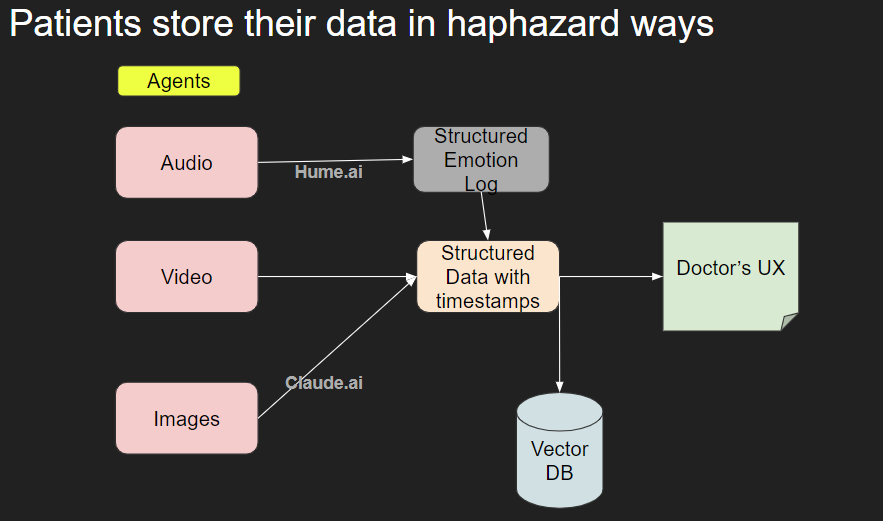

# Medical Agents 🏥🤖

Converting medical data into structured insights for doctors through AI-powered analysis and generative UX.

## 🏗️ Architecture

Below is the architecture diagram of the Medical Agents system:

## 🌟 Features

- 🎤 Audio transcription and emotion analysis
- 🖼️ Medical image processing
- 🎬 Video content extraction
- 📊 Structured data conversion
- 💻 Generative UX for intuitive data presentation

## 🧠 How It Works

1. **Data Ingestion**: The system accepts various types of medical data (audio, images, video).
2. **AI Processing**: Our advanced AI models analyze and extract relevant information.
3. **Structured Data Conversion**: Extracted data is converted into a standardized format.
4. **Generative UX**: AI-powered interface presents insights in an intuitive, doctor-friendly manner.

## 🛠️ Technologies Used

- Hume.ai for Audio and Video Emotion Detection
- Claude Sonnet for Image to JSON

